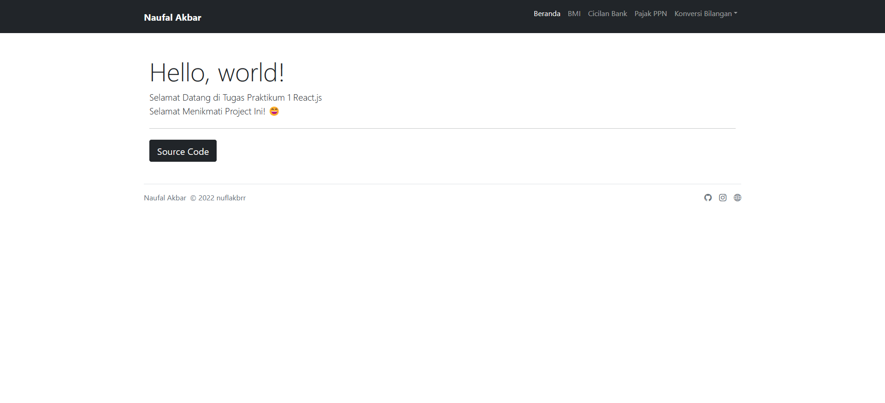
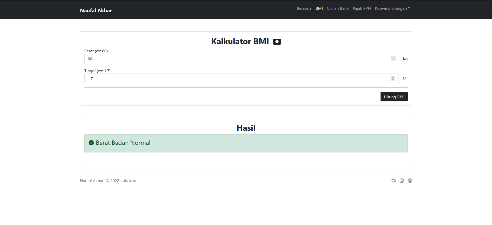
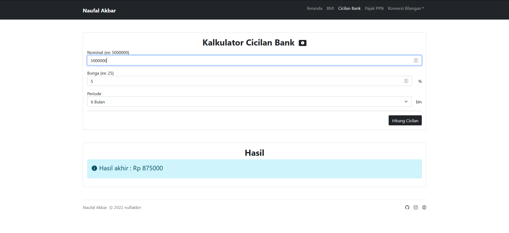
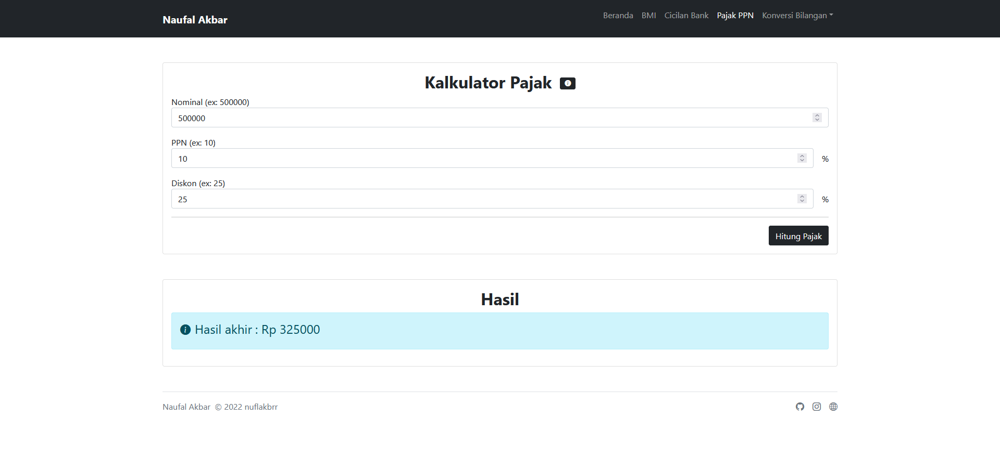
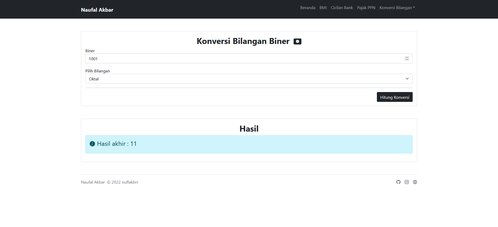
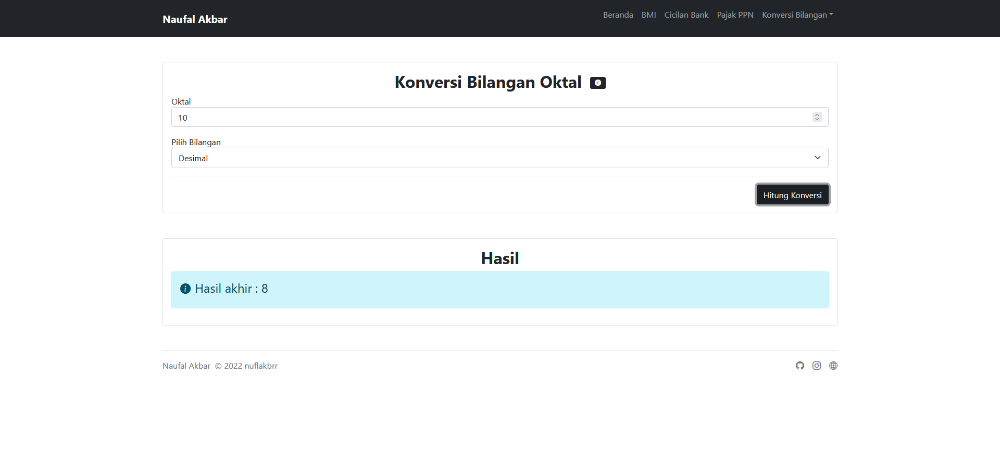
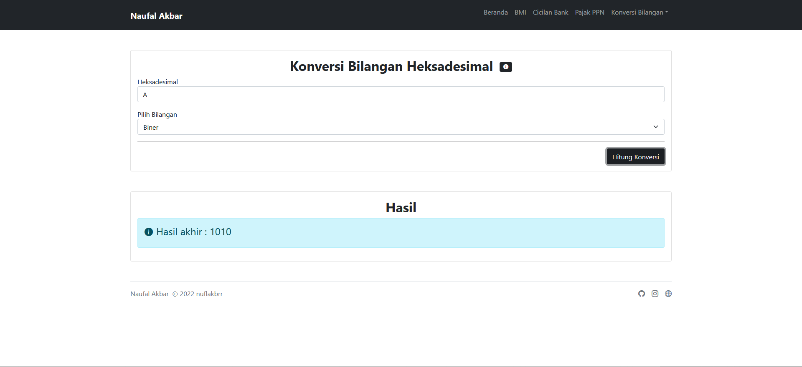

# github.com/nuflakbrr/react-praktikum

Create an few Study Case in One Project for [SMK Telkom Malang](https://smktelkom-mlg.sch.id).

## On this Project

- [x] Kalkulator BMI
- [x] Kalkulator Cicilan Bank
- [x] Kalkulator Pajak PPN
- [x] Kalkulator Konversi Bilangan

## Frameworks / Library in use

- [x] React.js
- [x] Bootstrap (Icons, Jquery, Popper.js)
- [x] React Router Dom
- [x] React Helmet
- [x] React Markdown

## Screenshoots

- Beranda

- BMI

- Cicilan Bank

- Pajak PPN

- Konversi Bilangan

    - Biner
    

    - Oktal
    

    - Desimal
    

    - Heksadesimal
    

## Authors

Contributors names and contact info

Naufal Akbar Nugroho  
[@kbrnugroho](https://instagram.com/kbrnugroho)
